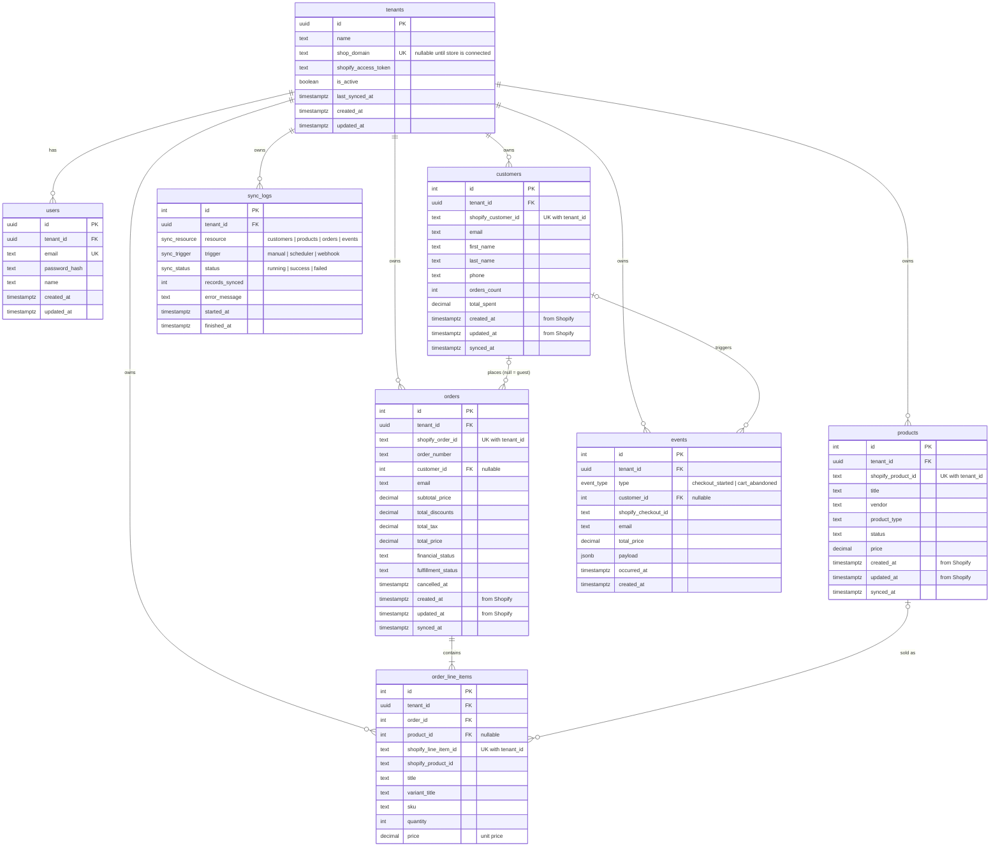

# ER diagram

Generated from [`backend/prisma/schema.prisma`](../../backend/prisma/schema.prisma). Table and column names are as they appear in PostgreSQL.

```mermaid
erDiagram
    tenants ||--o{ users : "has"
    tenants ||--o{ customers : "owns"
    tenants ||--o{ products : "owns"
    tenants ||--o{ orders : "owns"
    tenants ||--o{ order_line_items : "owns"
    tenants ||--o{ events : "owns"
    tenants ||--o{ sync_logs : "owns"
    customers |o--o{ orders : "places (null = guest)"
    orders ||--|{ order_line_items : "contains"
    products |o--o{ order_line_items : "sold as"
    customers |o--o{ events : "triggers"

    tenants {
        uuid id PK
        text name
        text shop_domain UK "nullable until store is connected"
        text shopify_access_token
        boolean is_active
        timestamptz last_synced_at
        timestamptz created_at
        timestamptz updated_at
    }
    users {
        uuid id PK
        uuid tenant_id FK
        text email UK
        text password_hash
        text name
        timestamptz created_at
        timestamptz updated_at
    }
    customers {
        int id PK
        uuid tenant_id FK
        text shopify_customer_id "UK with tenant_id"
        text email
        text first_name
        text last_name
        text phone
        int orders_count
        decimal total_spent
        timestamptz created_at "from Shopify"
        timestamptz updated_at "from Shopify"
        timestamptz synced_at
    }
    products {
        int id PK
        uuid tenant_id FK
        text shopify_product_id "UK with tenant_id"
        text title
        text vendor
        text product_type
        text status
        decimal price
        timestamptz created_at "from Shopify"
        timestamptz updated_at "from Shopify"
        timestamptz synced_at
    }
    orders {
        int id PK
        uuid tenant_id FK
        text shopify_order_id "UK with tenant_id"
        text order_number
        int customer_id FK "nullable"
        text email
        decimal subtotal_price
        decimal total_discounts
        decimal total_tax
        decimal total_price
        text financial_status
        text fulfillment_status
        timestamptz cancelled_at
        timestamptz created_at "from Shopify"
        timestamptz updated_at "from Shopify"
        timestamptz synced_at
    }
    order_line_items {
        int id PK
        uuid tenant_id FK
        int order_id FK
        int product_id FK "nullable"
        text shopify_line_item_id "UK with tenant_id"
        text shopify_product_id
        text title
        text variant_title
        text sku
        int quantity
        decimal price "unit price"
    }
    events {
        int id PK
        uuid tenant_id FK
        event_type type "checkout_started | cart_abandoned"
        int customer_id FK "nullable"
        text shopify_checkout_id
        text email
        decimal total_price
        jsonb payload
        timestamptz occurred_at
        timestamptz created_at
    }
    sync_logs {
        int id PK
        uuid tenant_id FK
        sync_resource resource "customers | products | orders | events"
        sync_trigger trigger "manual | scheduler | webhook"
        sync_status status "running | success | failed"
        int records_synced
        text error_message
        timestamptz started_at
        timestamptz finished_at
    }
```
